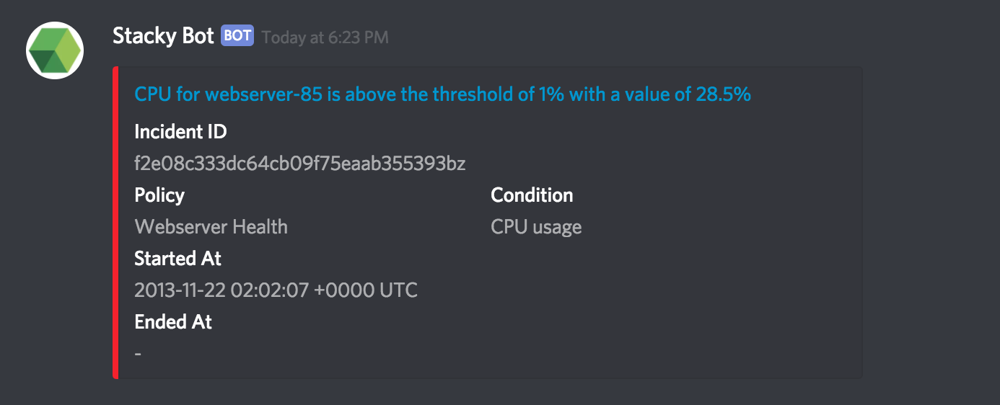

# alert-to-discord

⚙️ A simple Google Cloud Function in Go to transform / proxy Stackdriver Static Webhook notifications to Discord.
⚙️ A simple Google Cloud Function in Go to transform / proxy phabricator Webhook notifications to Discord.

_This requires Google Cloud Functions Alpha with Go support. This project has been tested with the Go 1.11, and Go 1.13 runtimes_

## Getting Started

### local development
ngrok http 8080
export PHAB_API_TOKEN=api-od3qax3kwyaegovunoxaamcogwbe
export SLACK_SECRET=5eebaa050b5ed44ff663ac812dc33cd5
cd cmd 
go run main.go

### Prerequisites

- Ensure you have `gcloud` installed:
    - MacOS: `brew cask install google-cloud-sdk`
    - Others: https://cloud.google.com/sdk/gcloud
- Ensure you have authenticated with Google Cloud: `gcloud auth login`
- Set your current working project: `gcloud config set project <project>`

### Deployment

1. Clone / download a copy of this repository
2. modify variables on `.env.staging.yaml` and `.env.production.yaml` as
3. Run `./deploy-staging.sh` or `./deploy-prod.sh`
4. Configure Stackdriver static webhook notification in https://app.google.stackdriver.com/settings/accounts/notifications/static-webhook/add
5. add a http request on phabricator

_Be sure to append `?auth_token=<AUTH_TOKEN>` to the end of the URL under `httpsTrigger` (returned in the output from (3)). e.g. https://my-region-my-organisation.cloudfunctions.net/stackdriver-to-discord?auth_token=123456._
